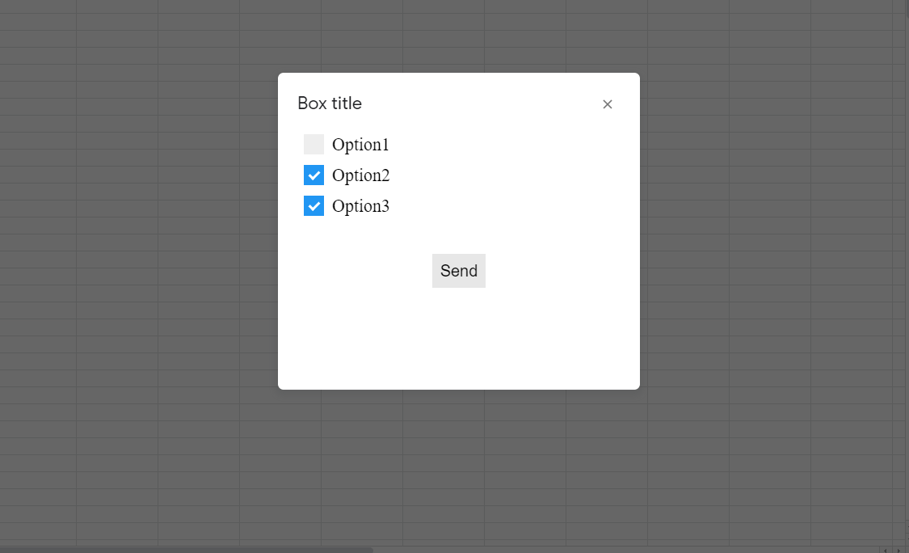
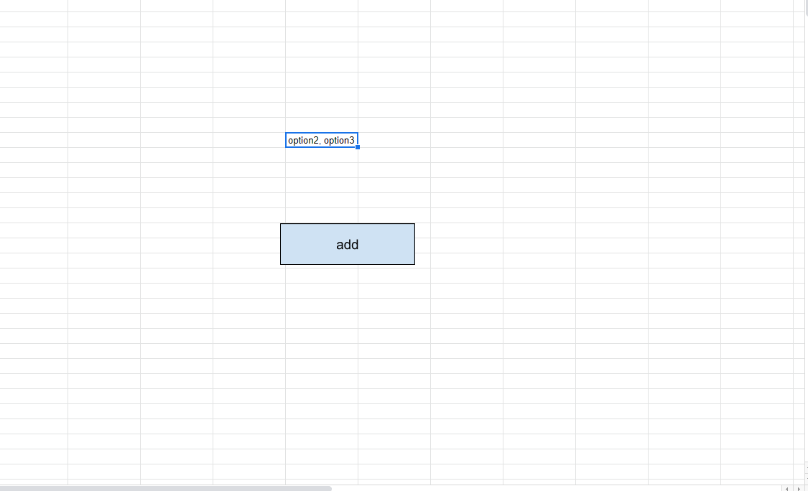

### Workflow:
1. Select cell where you want to insert values.
2. Click "add" button in order to open dialog box with options.
3. Select options.
4. Click "Send" button.

### In order to add next option to list:   
1) In view.html add:   

```
  <label class="container">   
       X - this is visible in dialog box   
       <input name= 'x' type="checkbox" value="x" /> - name should be unique, value is visible in your sheet   
       <span class="checkmark"></span>  
   </label>   
```   
2) In ``processForm`` function add ``options.push(formObject.x);`` line, 
 where x is input's name from form in view.html (eg. ``<input name= 'option3' type="checkbox" value="option3" />``).  
3) Create new button and assign ``showDialog`` function to it.

Screenshots:    
    
    

