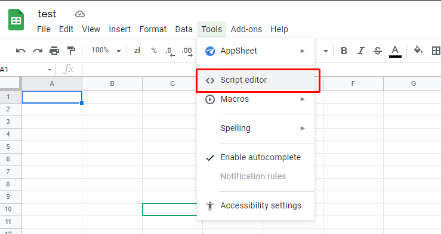
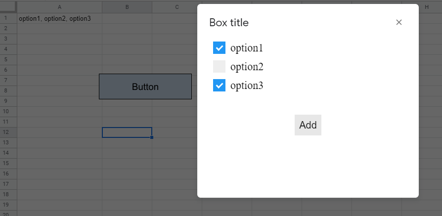
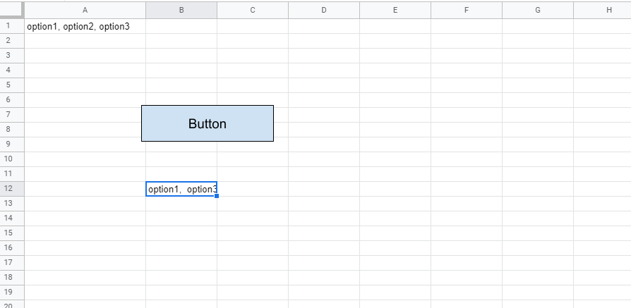

Script for google sheets which allows user to select multiple values from dialog. User defines these values in A1 cell.     


### Installation
1. In order to add this script to google sheet go to Tools -> script editor.    


2. In this repository open Code.gs file and copy all its content to Code.gs file in script editor.

3. In script editor add new HTML file, name it view.html and copy there content of view.html file.

4. Authorize newly added script to access your data.

5. Create new button and assign ``showDialog`` function to it.



### Workflow:
1. In cell A1 add comma separated values (You can change cell in `get_options` function).  
1. Select cell where you want to insert values.
2. Click button in order to open dialog box.
3. Select options.
4. Click "Add" button.


Screenshots:    
    
    
